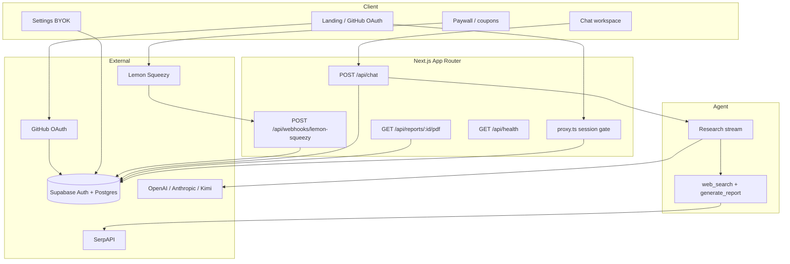
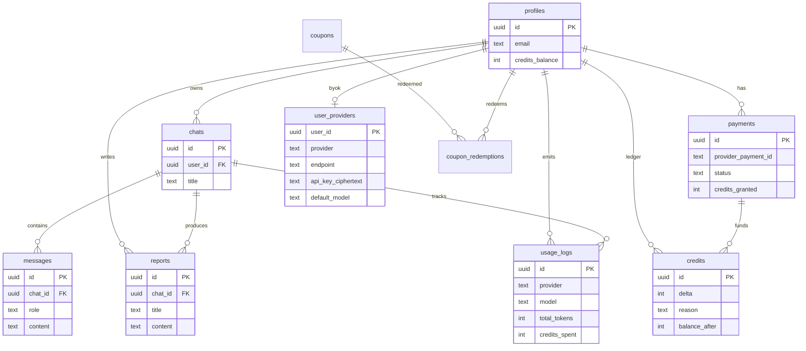

# MicroManus

Premium AI deep-research workspace. Users bring their own OpenAI, Anthropic, or Kimi key. MicroManus plans, searches the web, and streams grounded answers with optional PDF reports.

## One-command setup

```bash
npm run setup
```

Then fill Supabase / SerpAPI (and optionally Lemon) values in `.env.local`, apply migrations, and start:

```bash
npx supabase db push   # or run SQL in supabase/migrations/ in order
npm run dev
```

Open [http://localhost:3000](http://localhost:3000).

## One-command deploy

```bash
npm run deploy
```

Requires the [Vercel CLI](https://vercel.com/docs/cli) (`vercel login` once). Set the same env vars from `.env.example` in the Vercel project, point Lemon’s webhook at `/api/webhooks/lemon-squeezy`, and ensure GitHub OAuth callback matches your production URL.

## Stack

| Layer | Choice |
| --- | --- |
| App | Next.js 16 (App Router) + React 19 + TypeScript |
| UI | Tailwind CSS 4 + shadcn/ui |
| Auth / DB | Supabase Auth (GitHub) + Postgres + RLS |
| Agent | Vercel AI SDK + BYOK (OpenAI / Anthropic / Kimi) |
| Search | SerpAPI |
| Billing | Lemon Squeezy + credit ledger |

## Setup instructions

1. **Bootstrap**
   ```bash
   npm run setup
   ```
   Copies `.env.example` → `.env.local`, generates `PROVIDER_ENCRYPTION_KEY`, runs `npm install`.

2. **Supabase**
   - Create a project and copy URL + anon + service role keys into `.env.local`.
   - Apply migrations (`supabase/migrations/00001` … `00008`) via Dashboard SQL editor or:
     ```bash
     npx supabase link --project-ref <ref>
     npx supabase db push
     ```
   - **Auth → Providers → GitHub**: enable and set callback  
     `{NEXT_PUBLIC_APP_URL}/auth/callback`.

3. **SerpAPI** — set `SERPAPI_API_KEY` for web search tools.

4. **Billing (production)**
   - Create a Lemon Squeezy store + variant for the credit pack.
   - Set `LEMON_SQUEEZY_*` env vars.
   - Webhook URL: `{NEXT_PUBLIC_APP_URL}/api/webhooks/lemon-squeezy`  
     Event: `order_created`. Copy the signing secret.
   - **Test mode:** create a separate webhook while Test mode is ON (test signing secret differs from live). Apply migration `00008` so `fulfill_lemon_order` exists.
   - After checkout, the paywall also reconciles recent paid orders if the webhook is delayed.

5. **Run**
   ```bash
   npm run dev
   ```

New users start with **0 credits** and hit the paywall until they purchase or redeem a coupon (`SID_DRDROID` by default — configure in DB).

## Deployment instructions

### Vercel (recommended)

1. Push the repo and import into Vercel, **or** run `npm run deploy`.
2. Configure env vars from `.env.example` (production `NEXT_PUBLIC_APP_URL` required).
3. Redeploy after env changes.
4. Update Supabase Auth Site URL + GitHub OAuth callback to the production domain.
5. Update Lemon webhook URL to production.
6. Smoke-check `GET /api/health` (returns `ok: true` when core config is present).

### Self-host

```bash
npm run build
npm run start
```

Node 20+ recommended. Set all env vars in the process environment. Use a process manager or container that can reach Supabase and outbound LLM/search APIs.

`vercel.json` raises chat function `maxDuration` to 300s for long research runs.

## Scripts

| Script | Purpose |
| --- | --- |
| `npm run setup` | Bootstrap env + install |
| `npm run dev` | Local development |
| `npm run build` | Production build |
| `npm run start` | Serve production build |
| `npm run lint` | ESLint |
| `npm run typecheck` | TypeScript (`tsc --noEmit`) |
| `npm run deploy` | Build + `vercel --prod` |

## Shortcuts

| Shortcut | Action |
| --- | --- |
| `⌘K` / `Ctrl+K` | Command menu |
| `N` | New research |
| `A` | Analytics |
| `S` | Settings |
| `B` | Billing |
| `Enter` | Send research prompt |
| `Shift+Enter` | Newline in composer |

## Architecture



### Request path (research)

1. Authenticated user submits a prompt from the chat UI.
2. `/api/chat` verifies same-origin, rate-limits, loads encrypted BYOK config, creates/loads the chat.
3. One credit is deducted atomically via `grant_credits` (refunded if the stream fails or aborts before completion).
4. The research agent streams with tools (search + report). Assistant message, usage log, and optional report are persisted.
5. UI renders timeline parts, markdown answer, and PDF download card.

## Database



### Security notes

- `credits_balance` cannot be updated by authenticated clients (trigger + no update policy). Mutations go through `grant_credits` / `fulfill_lemon_order` as `service_role`.
- Lemon webhooks verify HMAC signatures; credit amount is taken from server config, not `custom_data`.
- BYOK endpoints are allowlisted per provider (HTTPS only) to reduce SSRF risk.
- Provider keys are AES-256-GCM encrypted at rest.
- Markdown links are protocol-sanitized; PDF filenames are header-safe.
- Cookie-authenticated chat POSTs require same-origin `Origin`/`Referer` in production.

## Health

```bash
curl -s http://localhost:3000/api/health | jq
```

## License

Private — all rights reserved.
